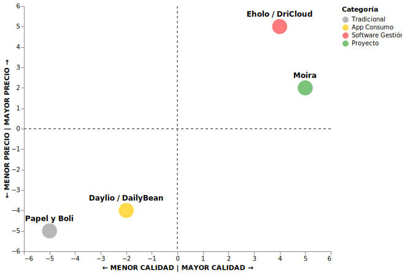

# 2. Estrategia de Marketing

## 2.1. Segmentación del Mercado

### 2.1.1. Criterios de segmentación

Para no dar palos de ciego, dividimos nuestro mercado analizando a quién le duele de verdad el problema de la gestión del tiempo terapéutico. No todos los profesionales ni todos los pacientes encajan aquí.

- **Demográficos:** 
  Apuntamos a psicoterapeutas y psicólogos clínicos que trabajen de forma independiente o en pequeños gabinetes asociados (normalmente de 25 a 55 años). Este grupo tiene soltura con el móvil pero aborrece la tecnología médica farragosa. Por el lado de los pacientes, el espectro es amplio: adultos de 18 a 50 años que asisten a terapia en el ámbito privado.
  
- **Geográficos:**
  El foco de lanzamiento se sitúa en España, cumpliendo a rajatabla el estricto Reglamento General de Protección de Datos (RGPD) en su vertiente de salud. La idea es consolidarse primero a nivel nacional antes de plantear la traducción de la herramienta.
  
- **Psicográficos:**
  Profesionales que priorizan la calidad humana de la sesión y sienten que la burocracia les roba tiempo de oro. Pacientes con un rol activo en su bienestar mental, capaces de usar su smartphone como un diario reflexivo, pero que necesitan sencillez para no tirar la toalla al tercer día.
  
- **Conductuales:**
  Terapeutas con un volumen de trabajo alto (más de 15 sesiones por semana) y que utilicen ya alguna herramienta de videollamada o agenda online. Pacientes propensos a abandonar los registros en papel o que acaban inventándose el resumen de la semana en la misma sala de espera de la consulta.

---

## 2.2. El _Target_

Aquí es donde ponemos caras y nombres para entender con quién estamos hablando. Hemos diseñado dos perfiles clave que representan la dualidad de nuestra app.

### La profesional
*   **Contexto:** Trabaja en su propia consulta. 
*   **Problema:** Pasa los primeros 15 minutos de cada consulta intentando que el paciente haga memoria de lo que sintió tras una discusión familiar ocurrida hace seis días. Siente que esta ocupando mucho tiempo y le resta efectividad al tratamiento.
*   **Expectativa:** Busca una gráfica limpia y centralizada en su ordenador que le revele las fluctuaciones emocionales de su semana. Y está dispuesta a pagar una suscripción mensual fija si eso le devuelve el control de su tiempo de terapia.

### El paciente
*   **Contexto:** Acude a terapia semanalmente.
*   **Problema:** Su terapeuta le da fichas en papel para registrar sus crisis, le manda actividades para realizar en casa y enocasiones le cuesta mantener la constancia en la realizacion de las mismas.
*   **Expectativa:** Busca una interfaz móvil rápida, bonita y privada donde pueda registrar un ataque de pánico en menos de 30 segundos, sin campos innecesarios y recibiendo recordatorios para poder mantener la constancia en la realizacion de las mismas. Registra eventos importantes a tratar en la sesión a través de preguntas.

---

## 2.3. Posicionamiento

### Justificación

La app nace como una herramienta para mejorar la terapia individual. Queremos ofrecer una solución que agilice el trabajo de los terapeutas y mejore la relación con sus pacientes. El paciente obtendriía una terapia más eficiente, personalizada y efectiva y el psicologo podria obtener una herramienta que le ayude a mejorar la relación con sus pacientes y a obtener información valiosa para el tratamiento, además de ahorrarse tiempo en la gestión de su consulta, por lo que podría reducir sus costes operativos y aumentar su rentabilidad. 

### Calidad del producto/servicio

Buscamos un nivel de **calidad alto**. Queremos hacer un entorno clínico seguro. La app no busca reemplazar la relación terapéutica, si no potenciarla.

#### ¿Cómo se materializa esta calidad?

1.  **Análisis inteligente de patrones:**
    El software procesa el registro y genera tendencias emocionales legibles. Facilita la terapia, permitiendo al profesional ver las fluctuaciones emocionales de su paciente y ajustar el tratamiento en consecuencia.
    
2.  **Privacidad por diseño (Privacy by Design):**
    Los datos se cifran en el dispositivo del paciente. Él decide compartirlos de forma cifrada directamente con el profesional. Sin intermediarios husmeando sus emociones.
    
3.  **Experiencia de usuario empática (UX/UI):**
    Una app fría desmotiva. El diseño de Moira se siente orgánico, cercano y con colores suaves que transmiten calma, no distancias clínicas.
    
4.  **Registro ágil de episodios:**
    Nada de cuestionarios interminables. En pocos toques se anota el detonante, la intensidad, los síntomas físicos y el pensamiento asociado.

### Precio de venta

Se establecerá un **precio medio-alto** bajo suscripción exclusiva para el profesional. Si una herramienta es útil y ahorra tiempo de facturación indirecta, el psicólogo la pagará encantado porque el **retorno de la inversión** es evidente: menos sesiones improductivas y mayor fidelización de sus pacientes. Para el paciente, el uso de la app será gratuito, como parte de la licencia de su terapeuta.

---

### Competencia y soluciones existentes

El panorama del bienestar digital está muy fragmentado, pero podemos agrupar a los competidores en tres trincheras:

#### 1. Software de recordatorios tradicionales. (Ej. Todoist, Microsoft To Do, Google Keep)
*   **El problema:**: Son softwares excelentes para gestionar tareas generales, pero el psicologo no tiene acceso, y no es personalizada a sus necesidades. Ademas, requiere un esfuerzo adicional por parte del paciente para utilizarlos correctamente. No estan diseñados para el registro emocional.
*   **Nuestra ventaja:** Moira ofrece una experiencia personalizada, con un diseño basado en la psicologia cognitivo-conductual, y con acceso para el psicologo.

#### 2. El autorregistro tradicional (papel y boli)
*   **El problema:** Se pierde, no genera estadísticas automáticas y la gente tiende a completarlo de memoria justo antes de entrar a consulta, falseando el sesgo retrospectivo.
*   **Nuestra ventaja:** Permite el registro en caliente (en el momento del episodio) y genera análisis de patrones de forma instantánea.

---

### 2.3.1. Propuesta de valor

Queremos que Moira sea percibida como algo más que un simple software de suscripción.

*   **Para el paciente:** Un espacio digital seguro, discreto y sin juicios que le permite dar nombre a lo que siente en su día a día.
*   **Para el psicólogo:** Un aliado estratégico que amplifica su intuición clínica y le ahorra el trámite de recabar datos retrospectivos durante la consulta, permitiéndole ir directo al grano.

### 2.3.2. Mapa de posicionamiento

---

## 2.4. Estrategia General

Nuestra ruta estratégica se apoya en tres pilares conceptuales para consolidar la marca:

### 2.4.1. Estrategia Competitiva (Diferenciación Focalizada)
No buscamos ser la app de meditación de millones de personas ni el software administrativo de grandes hospitales. Nos enfocamos exclusivamente en la **diferenciación por utilidad clínica y diseño** para gabinetes y terapeutas independientes de salud mental. Ofrecemos valor a través de la privacidad extrema y la facilidad de uso.

### 2.4.2. Estrategia de Crecimiento (Matriz de Ansoff)
Apostamos por el **Desarrollo de Producto**. Introducimos una herramienta tecnológica totalmente nueva y adaptada (Moira) en un mercado existente (psicólogos y terapeutas autónomos que ya realizan terapia clínica y usan métodos tradicionales como el papel o plataformas genéricas).

### 2.4.3. Estrategia de Marca (Brand Strategy)
La marca "Moira" evoca el concepto clásico de tomar las riendas de la propia vida y el destino. Toda la identidad visual y el tono de comunicación huirán de la frialdad médica corporativa. Buscamos transmitir calidez, empatía y solvencia científica. La seguridad de los datos no es una opción de marketing, sino la base ética sobre la que cimentamos la marca.
